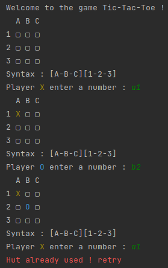

# Tic Tac Toe

### preview : 

### run : 

First you must have `rust` and `cargo` install

You can generate documentation by using `cargo doc` on the source of the file

You can run by using `cargo run --release` on the source of the file

